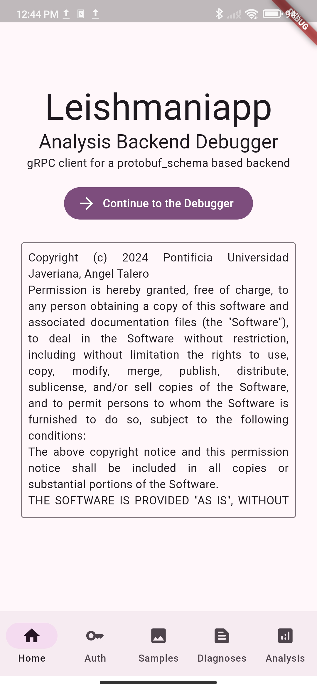
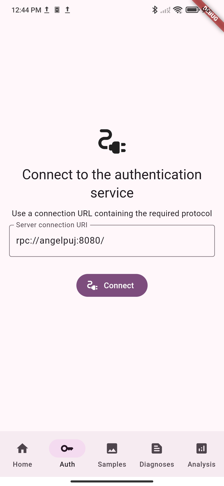
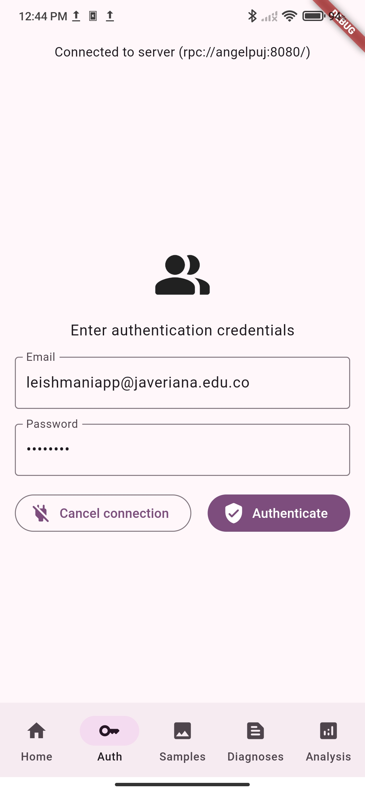
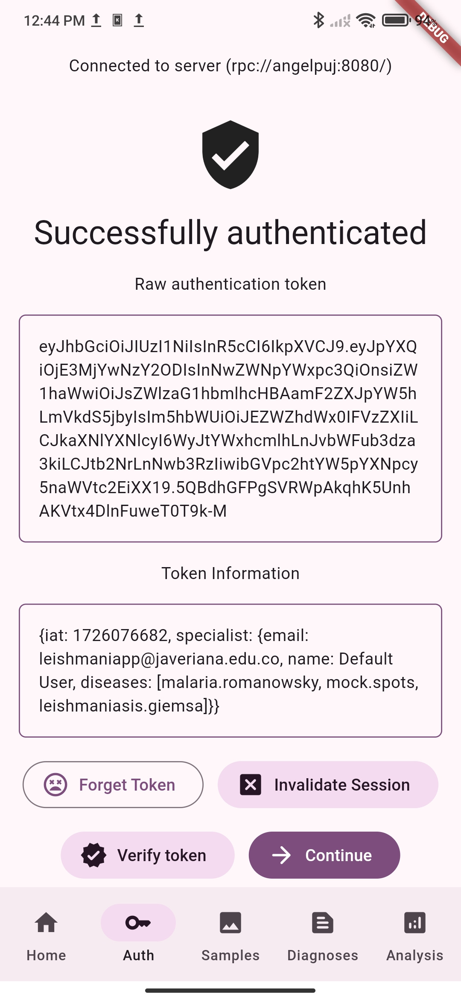
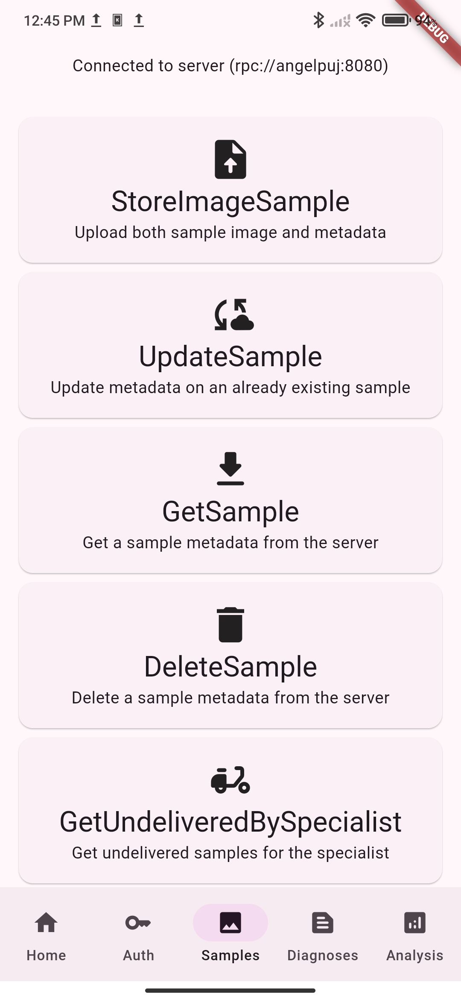
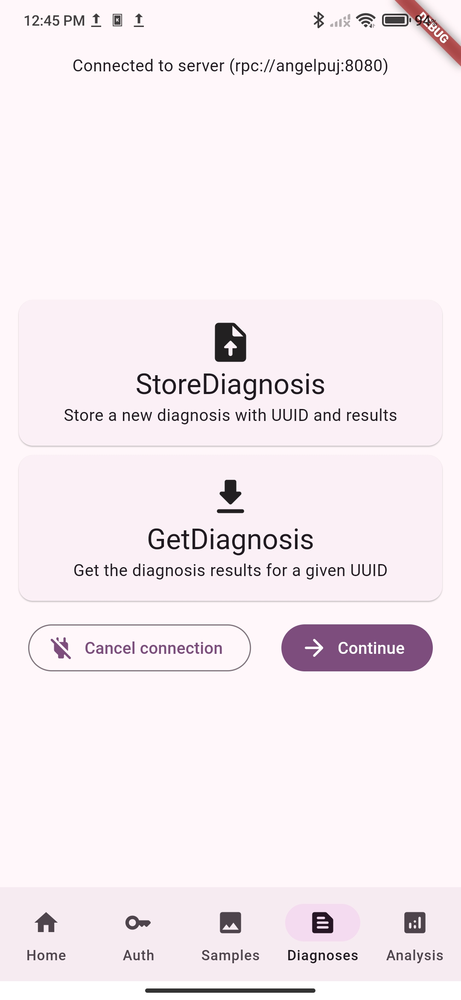
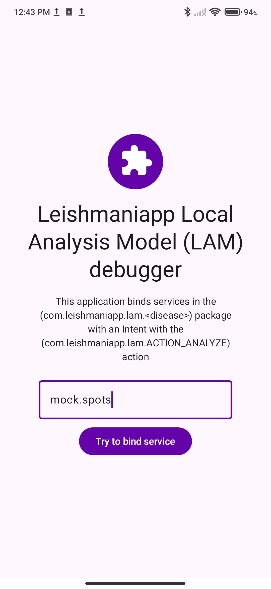
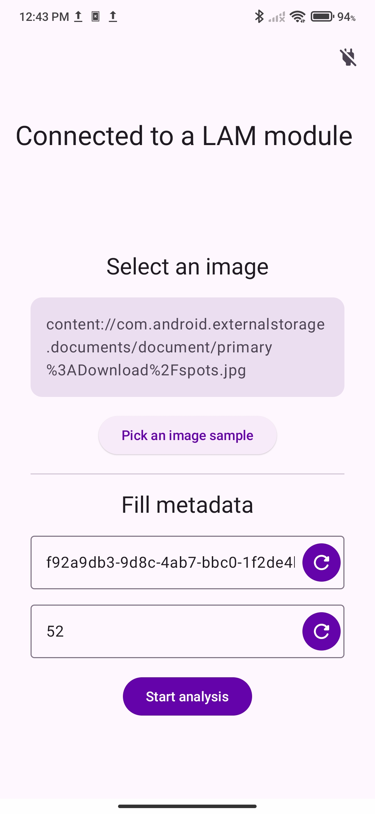
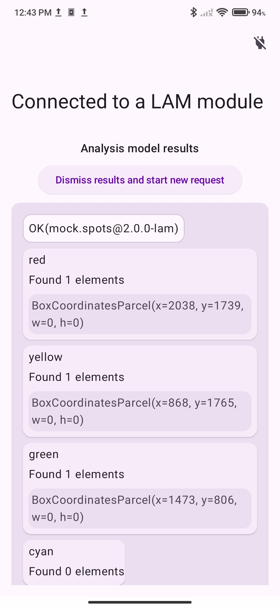

# 🪲 Depuradores
Aplicaciones adicionales creadas con el fin de depurar y probar la infrastructura de Leishmaniapp durante su desarrollo

## Leishmaniapp Backend Debugger
>  Link del repositorio: [github.com/leishmaniapp/backend_debugger](https://github.com/leishmaniapp/backend_debugger)

Aplicación utilizada como cliente gRPC para probar los métodos ofrecidos por cada uno de los [servicios](schema.md#servicios) de la [infrastructura cloud](cloud.md)

### Compilación
Esta es una aplicación multiplataforma construida con el framework _[Flutter](https://flutter.dev/)_, por lo que puede ser utilizada en cualquier dispositivo, para compilarla siga los siguientes pasos:

0. Instale el _SDK_ de _Flutter_ y verifique su instalación con `flutter doctor -v`
1. Clone el repositorio `git clone git@github.com:leishmaniapp/backend_debugger.git` y navegue hasta el directorio del proyecto
2. Descargue el submodulo para el _[esquema de protobuf](schema.md)_ con el siguiente comando:
   ```sh
   git submodule update --init --recursive
   ```
3. Descargue las dependencias del proyecto con el siguiente comando
   ```sh
   flutter pub get
   ```
4. Compile los archivos del _esquema de protobuf_ con el siguiente comando
   ```sh
   dart run build_runner build
   ```
5. Compile e instale el proyecto `flutter run -d (your device)`

### Funcionamiento
Una vez en la pantalla principal puede conectarse a cada uno de los servicios disponibles en la barra de navegación inferior, cada uno de estos servicios le solicitará una URL de conexión al servicio, utilice el protocolo `rpc://` para conectarse a los servicios. Una vez conectado se muestra un menú con todos los métodos disponibles, tenga en cuenta que algunos de estos servicios requieren autenticación, utilice la pestaña _'auth'_ para obtener el token.

A continuación algunas capturas de pantalla de la aplicación.

|                                                             |                                                 |                                                     |
| ----------------------------------------------------------- | ----------------------------------------------- | --------------------------------------------------- |
|                    |  |            |
|  |  |  |

## Leishmaniapp LAM Debugger
>  Link del repositorio: [github.com/leishmaniapp/lam-debugger-android](https://github.com/leishmaniapp/lam-debugger-android)

Aplicación utilizada para probar conexión con modelos [LAM](lam.md) locales en el dispositivo.

En la pantalla inicial digite el _identificador_ de la enfermedad a utilizar, el programa utilizará el nombre de paquete `com.leishmaniapp.lam.[disease]` (donde `[disease]` es el _identificador_ de la enfermedad previamente digitado) para enlazar el _bound service_ asociado al modelo _LAM_, luego de mostrará una pantalla desde la cual se selecciona la imagen a utilizar y se rellenan los metadatos de la petición, estos metadatos pueden ser autogenerados oprimiendo el botón situado al costado, una vez iniciado el análisis se mostrará una ventana de carga y finalmente se mostraran los resultados arrojados por el modelo.

A continuación capturas de pantallas del depurador analizando una muestra de la enfermedad de pruebas _mock.spots_

| Pantalla de Inicio                                 | Selección de imágen                                    | Resultados del modelo                                    |
| -------------------------------------------------- | ------------------------------------------------------ | -------------------------------------------------------- |
|  |  |  |