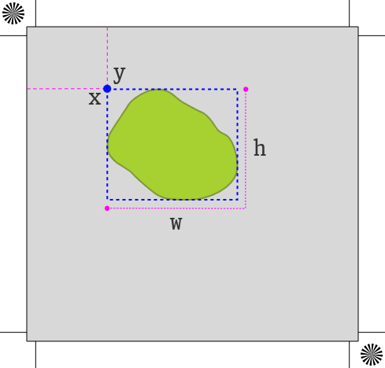
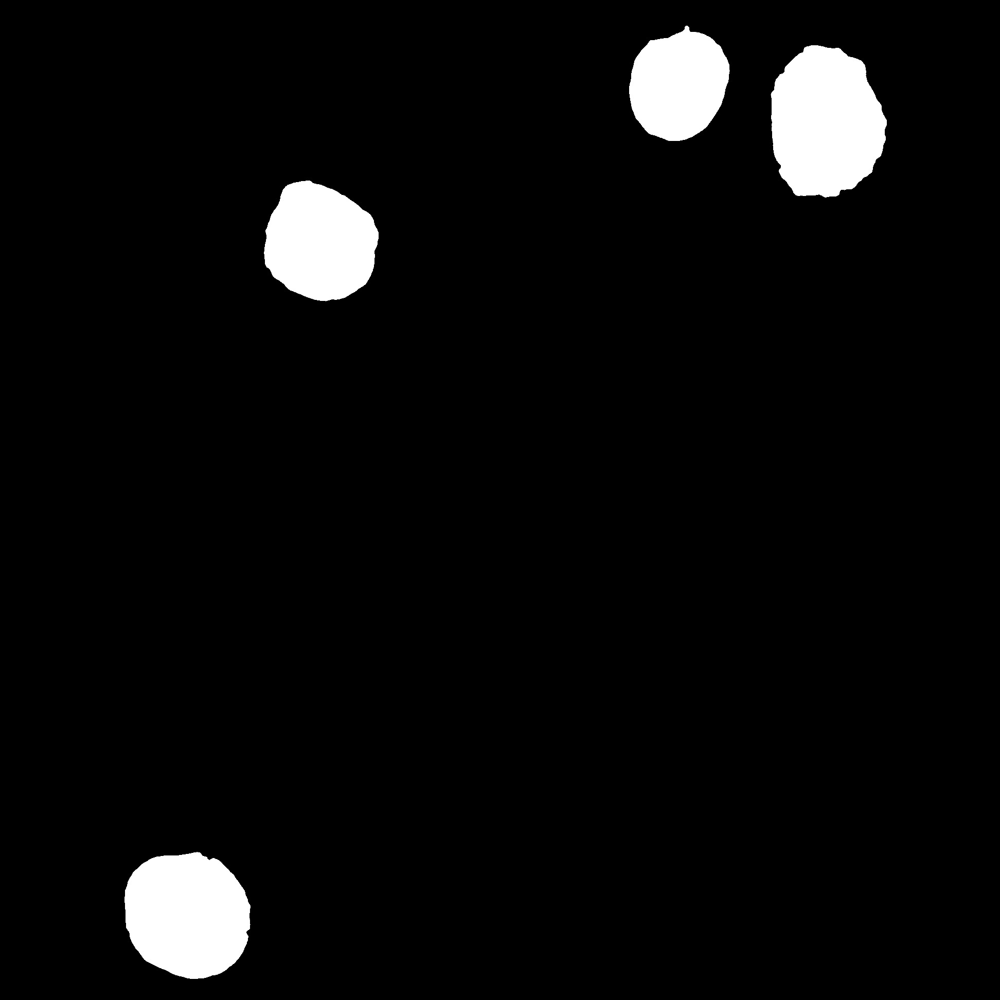
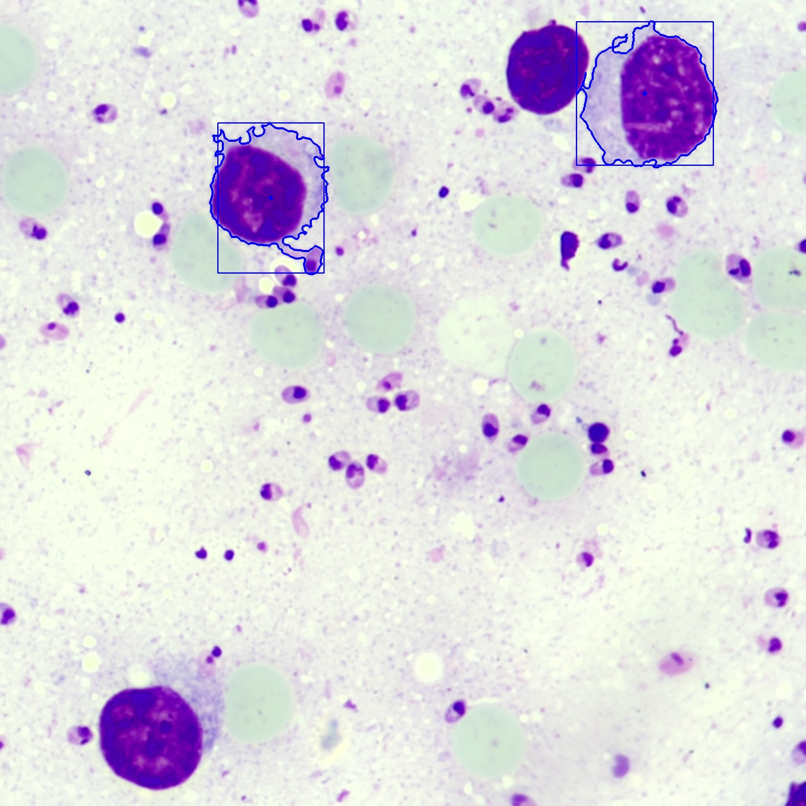
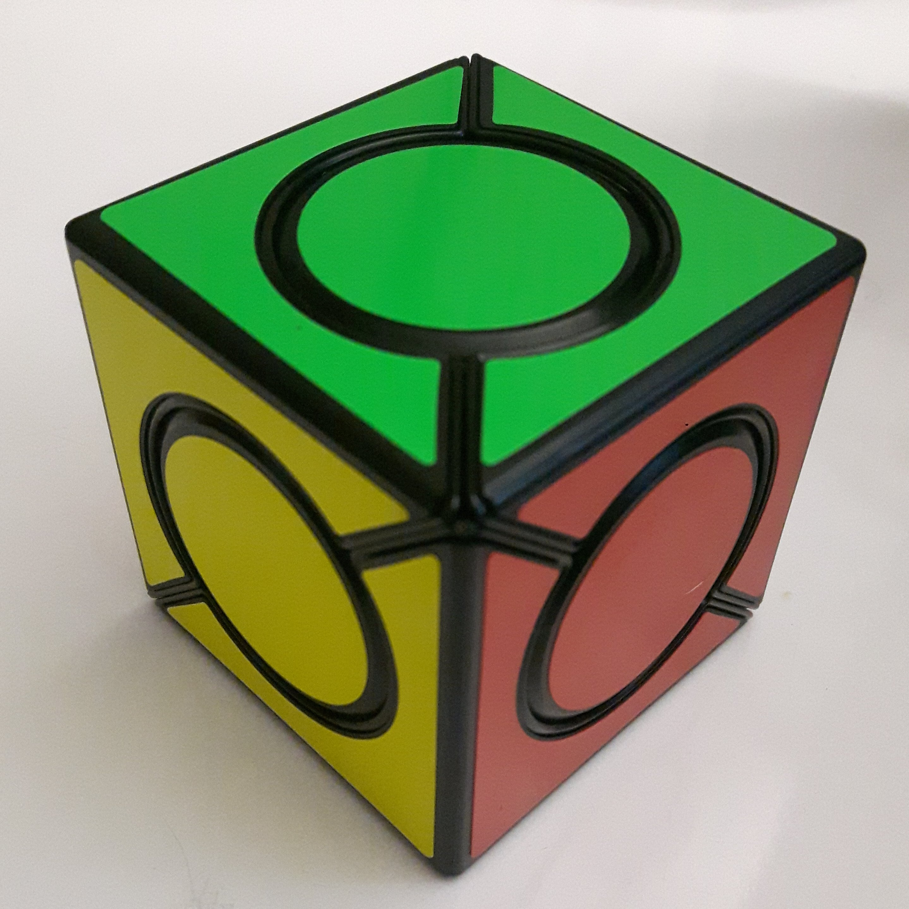
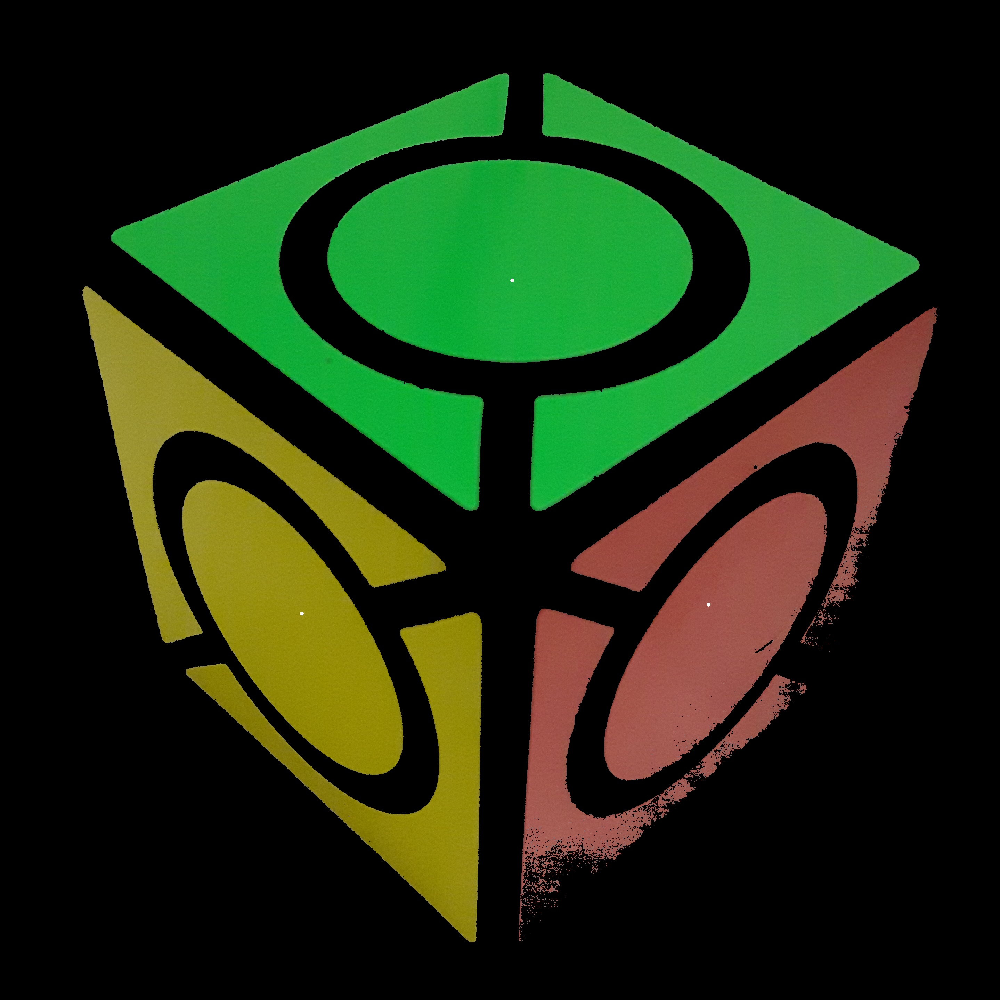

# 🔬 Modelos de Detección
Un modelo de detección es un programa capaz de detectar una serie de _elementos diagnósticos_ específicos a una _enfermedad_ dada una imagen de entrada.

## Elementos Diagnósticos
El modelo de detección debe de computar una lista de todos los elementos diagnósticos y los componentes de la caja más pequeña que lo contiene (_bounding box_), estos componentes son:

* **x**: Coordenada horizontal (imagen de la muestra como marco de referencia) de la esquina superior de la caja, unidad en pixeles, dirección, oeste-este
* **y**: Coordenada vertical (imagen de la muestra como marco de referencia) de la esquina superior de la caja, unidad en pixeles, dirección norte-sur
* **w**: Ancho de la caja
* **h**: Alto de la caja

Una imagen explicativa de las componentes en referencia a la muestra se muestra a continuación:



Algunos modelos no pueden computar una _bounding box_ para los elementos y en su lugar utilizan _centros de masa_, en este caso las componentes **w** y **h** deben contener el valor '0', esto será interpretado por la aplicación de Leishmaniapp como un _centro de masa_ en lugar de una _bounding box_

### Formato de los Resultados
Los modelos de detección deben de representar los resultados a través de un mapa llave-valor en la que la llave es el nombre del _elemento diagnóstico_ y el valor es una lista de componentes (_coordinates_) de cada uno de los elementos encontrados.

Ejemplo: suponga que una enfermedad _mock_ tiene 3 elementos diagnósticos: 'foo', 'bar' y 'baz', a continuación un ejemplo de los posibles resultados del modelo _mock_

```json
{
    "foo": [],
    "bar": [
        { "x": 10, "y": 10, "w": 2, "h": 3 },
        { "x": 40, "y": 20, "w": 5, "h": 5 }
    ],
    "baz": [
        { "x": 25, "y": 20, "w": 0, "h": 0 }
    ]
}
```

Esto implica que:

* No hay ningún elemento del tipo _foo_ en la muestra
* Hay 2 elementos del tipo _bar_ en la muestra, uno en las coordenadas (10, 10) y otro en (40, 20), cada uno con su respectiva caja contenedora
* Hay 1 elemento del tipo _baz_ en la muestra, su centro de masa se encuentra en la coordenada (25, 20)

## ALEF (Adapter Layer Exec Format)
Para que los modelos de análisis puedan ser integrados a _LeishmaniappCloudServiceV2_ (Veáse [documentación de cloud](cloud.md)) es necesario implementar un estándar de entradas y salidas que permitan al _[model_wrapper](cloud.md#model_wrapper)_ llamar a los modelos de análisis, este estándar tiene el nombre de _ALEF_ dentro de la infrastructura de Leishmaniapp, el nombre viene dado por el mecanismo que utiliza _model_wrapper_ para hacer el llamado a los modelos (_syscall exec_).

#### Entradas

```properties
absolute/path/to/executable <args> --alef-in <input> --alef-out <output>
```

* **--alef-in**: Argumento que especifica la ruta relativa o absoluta hacia el archivo de imagen que va a ser utilizado como entrada para el modelo, este argumento es obligatorio.
  
* **--alef-out**: Argumento que especifica la ruta relativa o absoluta hacia el archivo de imagen que será creado y escrito por el modelo, este archivo puede ser otra imagen que pueda ser requerida como input en otros modelos y es un argumento opcional. Todos los modelos deben de permitir este parámetro pero no necesariamente deben de hacer uso de él, puede ser ignorado.

Se recomienda que cualquier otro parámetro adicional sea opcional, de no ser así por favor asegúrese que los parámetros están correctamente establecidos en el archivo de configuración de _model_wrapper_

#### Salidas

Los resultados del modelo deben de ser escritos a la _salida estándar_ (`stdout`) y el código terminación del programa debe de ser `0`, si desea mostrar información de depuración o cualquier otro mensaje relevante para el usuario, debe de hacerlo a través del _error estándar_ (`stderr`) pues este será ignorado por _model_wrapper_ cuando la petición es exitosa.

Los resultados escritos en la salida estándar deben de estar en formato _JSON_ y seguir un esquema como el del siguiente ejemplo:
```json
{
  "a": [
    { "x": 25, "y": 100, "w": 10, "h": 10 },
    { "x": 65, "y": 150, "w": 20, "h": 20 },
    { "x": 100, "y": 50, "w": 30, "h": 30 }
  ],
  "b": [
    { "x": 50, "y": 25, "w": 10, "h": 20 },
    { "x": 68, "y": 185, "w": 10, "h": 20 }
  ]
}
```

Estos resultados son traducidos por `model_wrapper` en los resultados de la estructura [(leishmaniapp.cloud.model.Sample.results)](schema.md#muestras), ejemplo de los resultados traducidos en formato JSON:

```json
{
  "a": {
    "coordinates": [
      { "x": 25, "y": 100, "w": 10, "h": 10 },
      { "x": 65, "y": 150, "w": 20, "h": 20 },
      { "x": 100, "y": 50, "w": 30, "h": 30 }
    ]
  },
  ".b": {
    "coordinates": [
      { "x": 50, "y": 25, "w": 10, "h": 20 },
      { "x": 68, "y": 185, "w": 10, "h": 20 }
    ]
  }
}
```

Si el modelo falla, debe de retornar con un código de terminación diferente de 0, de esta manera _model_wrapper_ puede determinar la falla y se utilizará el texto del _error estándar_ como mensaje de error

#### Ejemplo
A continuación un ejemplo del modelo para la enfermedad de pruebas _mock.spots_ utilizando _ALEF_, utilice este código como base para la implementación de _ALEF_ en sus propios modelos escritos en _Python_

```python
#!/usr/bin/python

import argparse
import json
import logging
from sys import stderr
from model import DEFAULT_TOLERANCE, analyze


def main():

    # Create the logger
    handler = logging.StreamHandler(stream=stderr)
    logger = logging.getLogger()

    # Set the formatter
    formatter = logging.Formatter("%(asctime)s [%(levelname)s]: %(message)s")
    handler.setFormatter(formatter)

    # Set the handler
    logger.addHandler(handler)
    logger.setLevel(logging.DEBUG)

    # Declare the arguments
    parser = argparse.ArgumentParser()

    parser.add_argument(
        '--alef-in',
        '-i',
        dest="input",
        type=str,
        help="ALEF input filename",
        required=True,
    )

    parser.add_argument(
        '--alef-out',
        '-o',
        dest="output",
        type=str,
        help="ALEF output (generated mask)",
        required=False,
    )

    parser.add_argument(
        '--tolerance',
        '-t',
        dest="tolerance",
        type=int,
        help="Range of accepted hue values for a color",
        required=False,
        default=DEFAULT_TOLERANCE,
    )

    # Parse the arguments
    args = parser.parse_args()

    # Get the tolerance
    filepath = args.input
    output = args.output
    tolerance = args.tolerance

    # Run the model
    results = analyze(
        filepath,
        output,
        tolerance
    )

    # Show the output
    print(json.dumps(results))


if __name__ == '__main__':
    main()
```

## Modelos de Diagnóstico Soportados
A continuación una documentación de cada uno de los modelos de diagnóstico presentes en el respositorio de la organización de Leishmaniapp

### Leishmaniasis con tinción Giemsa

El identificador para esta enfermedad es `leishmaniasis.giemsa`, y se compone de dos elementos diagnósticos independientes: El modelo de detección de parásitos (_Leishmania spp._) identificado como `leishmaniasis.giemsa.parasites`, y el modelo de detección de macrófagos identificado como `leishmaniasis.giemsa.macrophages`.

| Modelo                                    | Propósito                                                                                           | Repositorio                                                                                                                              | Elementos Diagnósticos   |
| ----------------------------------------- | --------------------------------------------------------------------------------------------------- | ---------------------------------------------------------------------------------------------------------------------------------------- | ------------------------ |
| leishmaniasis.giemsa.parasites            | Identificación del parásito _Leishmaniap spp._ en muestras de Leishmaniasis con tinción giemsa      | [github.com/leishmaniapp/leishmaniasis-giemsa-parasites-model](https://github.com/leishmaniapp/leishmaniasis-giemsa-parasites-model)     | `parasite`               |
| leishmaniasis.giemsa.macrophages          | Identificación de macrófagos en muestras de Leishmaniasis con tinción giemsa                        | [github.com/leishmaniapp/leishmaniasis-giemsa-macrophages-model](https://github.com/leishmaniapp/leishmaniasis-giemsa-macrophages-model) | `macrophage`             |
| leishmaniasis.giemsa                      | Modelo conjunto (parásitos y macrófagos) con soporte para _[model_wrapper](cloud.md#model_wrapper)_ | [github.com/leishmaniapp/leishmaniasis-giemsa-disease](https://github.com/leishmaniapp/leishmaniasis-giemsa-disease)                     | `parasite`, `macrophage` |
| com.leishmaniapp.lam.leishmaniasis.giemsa | Implementación _[LAM](lam.md)_ para Android de _leishmaniasis.giemsa_ (parásitos y macrófagos)      | [github.com/leishmaniapp/leishmaniasis-giemsa-lam-android](https://github.com/leishmaniapp/leishmaniasis-giemsa-lam-android)             | `parasite`, `macrophage` |

#### Identificación de Parásitos

Este modelo hace uso de un clasificador entrenado (archivo _pickle_) para realizar la detección de parásitos

A continuación un ejemplo de una muestra que no ha sido analizada y los parásitos identificados luego de ser procesada por el modelo (las _bounding box_ han sido exageradas para mejorar la visualización, tomarán un tamaño menor en un análisis real)

| Muestra sin analizar                                                                                              | Muestra analizada                                                                                                   |
| ----------------------------------------------------------------------------------------------------------------- | ------------------------------------------------------------------------------------------------------------------- |
|  |  |

#### Identificación de Macrófagos

A continuación un ejemplo de una muestra que no ha sido analizada en contraste con la máscara generada por el modelo de detección de macrófagos y los resultados obtenidos resaltados.

| Muestra sin analizar                                                                                                 | Máscara generada                                                                                                  | Elementos resaltados                                                                                                      |
| -------------------------------------------------------------------------------------------------------------------- | ----------------------------------------------------------------------------------------------------------------- | ------------------------------------------------------------------------------------------------------------------------- |
|  |  |  |

Este modelo no contiene a los macrófagos en una _bounding box_, en su lugar, retorna su centro de masa

### Malaria con tinción Romanowsky

El identificador de esta enfermedad es `malaria.romanowsky` y es capaz de identificar leucocitos (`leukocyte`) y parásitos en 3 estadíos (`trophozoite`, `schizont` y `gametocyte`)

| Modelo                                  | Propósito                                                                                                                       | Repositorio                                                                                                              | Elementos Diagnósticos                              |
| --------------------------------------- | ------------------------------------------------------------------------------------------------------------------------------- | ------------------------------------------------------------------------------------------------------------------------ | --------------------------------------------------- |
| malaria.romanowksy                      | Identificación de leucocitos y parásitos (_Plasmodium spp._) en sus estadíos para muestras de Malaria con tinción de Romanowsky | [github.com/leishmaniapp/malaria-romanowsky-model](https://github.com/leishmaniapp/malaria-romanowsky-model)             | `leukocyte`,`trophozoite`, `schizont`, `gametocyte` |
| com.leishmaniapp.lam.malaria.romanowsky | Implementación _[LAM](lam.md)_ para Android de _malaria.romanowsky_                                                             | [github.com/leishmaniapp/malaria-romanowsky-lam-android](https://github.com/leishmaniapp/malaria-romanowsky-lam-android) | `leukocyte`,`trophozoite`, `schizont`, `gametocyte` |

A continuación un ejemplo de una muestra de malaria sin analizar y los resultados de una muestra analizada

| Muestra sin analizar                                                                   | Resultados resaltados                                                                        |
| -------------------------------------------------------------------------------------- | -------------------------------------------------------------------------------------------- |
|  |  |

Los resultados mostrados anteriormente pueden ser generados con el parámetro `--alef-out`

#### Funcionamiento

El modelo divide la identificación en 6 etapas:

1. Generación de máscara de leucocitos
2. Identificación de leucocitos
3. Generación de máscara de parásitos a partir de la máscara de leucocitos
4. Generación de recortes individuales de parásitos
5. Clasificación de parásitos
6. Clasificación de estadío de los parásitos

Las etapas del 1 al 4 se realizan exclusivamente mediante el uso de la librería _opencv_, la etapa de clasificación (5 y 6) utilizan clasificadores entrenados de _[TensorFlow Lite](https://www.tensorflow.org/)_ los cuales pueden ser encontrados en el directorio `src/models`, estos clasificadores se utilizan sobre cada uno de los recortes de parásitos individuales obtenidos en el paso anterior para determinar si son, o no, un parásito y el estadío en el que se encuentran

#### Análisis Externo
Las etapas de clasificación (5 y 6) hacen uso de la librería _TensorFlow Lite_, sin embargo, algunas plataformas pueden beneficiarse de librerías nativas que puedan hacer uso de algunos recursos de hardware (como gpu's) a los que _Python_ no tiene acceso. (Caso concreto, modelo _LAM_ hace uso de la librería nativa de _TFLite_).

Por esto, las etapas de clasificación (5 y 6) pueden ser interrumpidas, y en su lugar; obtener los recortes individuales de parásitos que son el punto de partida para un análisis externo al modelo implementado en _Python_.

Para activar esta característica utilice el parámetro `--external-parasite-analysis=[dir]` o `-e [dir]`, donde `[dir]` es la ruta absoluta o relativa a un directorio en donde los recortes individuales de los parásitos serán almacenados, el output del modelo será modificado y ahora en lugar de obtener únicamente los _elementos diagnósticos_ y sus componentes, se mostrará una tupla (2-d) con los siguientes valores

0. Mapa llave-valor de resultados _ALEF_
1. Mapa llave-valor en el que la llave es el nombre del archivo correspondiente a ese recorte de parásito, y como valor sus componentes

> ⚠️ Esta funcionalidad rompe con el esquema _ALEF_, por lo que esta opción no es compatible con _model_wrapper_

## Modelos de Prueba
Las anteriores enfermedades pueden dificultar el proceso de depuración de la arquitectura, es por eso que existen otra clase de "enfermedades" que son utilizadas únicamente con fines de prueba, los modelos de detección correspondientes a estar enfermedades procesan imagenes de objetos cotidianos que permitan depurar facilmente problemas en la aplicación o arquitectura sin contar con una muestra de laboratorio.

### Detector de Colores
El identificador para esta enfermedad/modelo de prueba es `mock.spots`, detecta los principales canales de color en una imagen y calcula los centros de masa del parche de color más grande en la muestra.

| Modelo                          | Propósito                                                   | Repositorio                                                                                              | Elementos Diagnósticos                              |
| ------------------------------- | ----------------------------------------------------------- | -------------------------------------------------------------------------------------------------------- | --------------------------------------------------- |
| mock.spots                      | Identificación de parches de color                          | [github.com/leishmaniapp/mock-spots-model](https://github.com/leishmaniapp/mock-spots-model)             | `red`, `green`, `blue`, `yellow`, `cyan`, `magenta` |
| com.leishmaniapp.lam.mock.spots | Implementación _[LAM](lam.md)_ para Android de _mock.spots_ | [github.com/leishmaniapp/mock-spots-lam-android](https://github.com/leishmaniapp/mock-spots-lam-android) | `red`, `green`, `blue`, `yellow`, `cyan`, `magenta` |

A continuación un ejemplo de una muestra de un cubo de rubik con los colores rojo, amarillo y verde; en contraste con la máscara generada por el modelo y un pequeño punto blanco marcando el _centro de masa_ de cada parche de color

| Muestra sin analizar                                           | Máscara generada                                           |
| -------------------------------------------------------------- | ---------------------------------------------------------- |
|  |  |

Los resultados de este modelo no se encuentran enmarcados por un _bounding box_, en su lugar, se calcula el centro de masa de cada uno de los parches de color.

Para ajustar la sensibilidad del modelo utilice el parámetro de entrada `--tolerance` o `-t`, el valor por defecto de la tolerancia es 10. Si quiere visualizar la máscara resultante puede hacer uso del parámetro `--alef-out` o `-o`