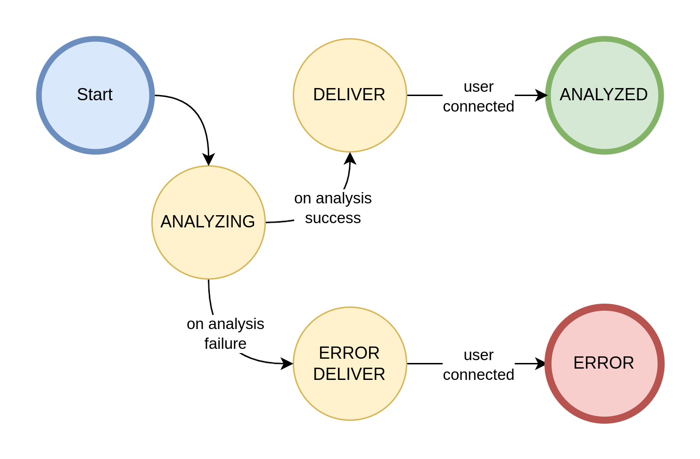

# 📐 Protobuf Schema

_protobuf_schema_ es mecanismo para serializar datos estructurados. Los esquemas Protobuf definen la estructura de los datos de manera eficiente y flexible, lo que permite la comunicación entre diferentes servicios, aplicaciones o componentes.

> 📚 Link del repositorio: [https://github.com/leishmaniapp/protobuf_schema](https://github.com/leishmaniapp/protobuf_schema)

## Vista General

Protobuf es una especificación que describe la estructura de los mensajes intercambiados entre los servicios del proyecto. Cada esquema se define en un archivo `.proto`, que contiene una lista de campos que el mensaje puede tener. A cada campo se le asigna un número único, que permanecerá constante a lo largo de las actualizaciones, lo que permite la compatibilidad hacia adelante y hacia atrás.

Los esquemas Protobuf se utilizan para definir:

- **Formatos de mensajes**: La estructura de los datos que se intercambian, como imágenes, resultados de análisis, diagnósticos u otros datos relacionados con los servicios.
- **Definiciones de servicios**: La estructura de las solicitudes y respuestas que se envían entre diferentes microservicios, como `auth_service`, `diagnoses_service`, `analysis_service` y `samples_service` (Véase [microservicios](cloud.md#microservicios)). Esto asegura que los datos se comuniquen en un formato estandarizado.

### ¿Por qué Protobuf?

1. **Serialización eficiente**: Los mensajes Protobuf son más pequeños y rápidos de serializar/deserializar en comparación con otros formatos como JSON o XML.
2. **Agnóstico del lenguaje**: Los esquemas Protobuf pueden compilarse en múltiples lenguajes de programación (como Python, Kotlin, Java), facilitando la interoperatividad entre servicios.
3. **Compatibilidad hacia adelante y hacia atrás**: Protobuf permite que el esquema evolucione con el tiempo mientras mantiene la compatibilidad con versiones anteriores.

## Tipos de Datos Básicos

### Respuesta de Estado
La manera en la que los servicios indican al cliente si la petición ha sido exitosa o fallida es a través del tipo de dato **leishmaniapp.cloud.types.StatusResponse**, este incluye un [código de estado](#codigos-de-estado) y un texto opcional con la descripción del error, el mensaje se define de la siguiente manera:

[//]: # (cSpell:disable)
```proto
package leishmaniapp.cloud.types;

message StatusResponse {
  StatusCode code = 1;
  optional string description = 2;
}
```
[//]: # (cSpell:enable)


#### Códigos de Estado
Los códigos de estado representan el resultado de la operación (Exitoso o Fallido) y el tipo de error que se presentó, estos códigos de estado están parcialmente basados en los [código de estado HTTP](https://developer.mozilla.org/es/docs/Web/HTTP/Status) y están definidos de la siguiente manera:

[//]: # (cSpell:disable)
```proto
package leishmaniapp.cloud.types;

enum StatusCode {
  UNSPECIFIED = 0;
  OK = 200;
  BAD_REQUEST = 400;
  FORBIDDEN = 403;
  UNAUTHENTICATED = 401;
  NOT_FOUND = 404;
  IM_A_TEAPOT = 418;
  UNPROCESSABLE_CONTENT = 422;
  INVALID_TOKEN = 498;
  INTERNAL_SERVER_ERROR = 500;
}
```
[//]: # (cSpell:enable)

A continuación se explican todos los códigos de estado disponibles:

| Nombre                | Código | Tipo           | Descripción                                                                                                          |
| --------------------- | ------ | -------------- | -------------------------------------------------------------------------------------------------------------------- |
| UNSPECIFIED           | 0      | Generic Error  | Error desconocido (Valor por defecto)                                                                                |
| OK                    | 200    | Ok             | Operación Exitosa                                                                                                    |
| BAD_REQUEST           | 400    | Client Error   | La petición del cliente está incompleta o tiene información inválida                                                 |
| FORBIDDEN             | 403    | Auth Error     | Las credenciales de autenticación son inválidas o han expirado                                                       |
| UNAUTHENTICATED       | 401    | Auth Error     | El usuario no se ha autenticado                                                                                      |
| INVALID_TOKEN         | 498    | Auth Error     | El _Header_ de autenticación no contiene un esquema _Bearer_                                                         |
| NOT_FOUND             | 404    | Client Error   | El recurso o servicio especificado no ha podido ser encontrado                                                       |
| IM_A_TEAPOT           | 418    | Client Error   | El servicio no puede atender una solicitud para lo cual no fue diseñado, ej. Autenticarse en el servicio de Análisis |
| UNPROCESSABLE_CONTENT | 422    | Analysis Error | El requerimiento de análisis tiene contenido no válido que no puede ser analizado                                    |
| INTERNAL_SERVER_ERROR | 500    | Server Error   | El servidor tuvo un error interno del cual no se pudo recuperar                                                      |

### Imágenes
Los archivos de imagen se serializan byte por byte desde el archivo de origen en un array de _bytes_. Esta información se almacena en el tipo de dato **leishmaniapp.cloud.types.ImageBytes**, los bytes del archivo se colocan uno a uno en el campo _data_ y el tipo de archivo en formato [MIME](https://developer.mozilla.org/en-US/docs/Web/HTTP/Basics_of_HTTP/MIME_types) se almacena en el campo _mime_. Los servicios que requieran reconstruir la imagen pueden crear un archivo cuya extensión corresponda al tipo _MIME_ del campo _mime_ y escribir los _raw bytes_ del campo _data_ directamente en el archivo.

[//]: # (cSpell:disable)
```proto
package leishmaniapp.cloud.types;

message ImageBytes {
  bytes data = 3;
  string mime = 4;
}
```
[//]: # (cSpell:enable)

### Coordenadas
Las coordenadas de cada uno de los elementos identificados durante el análisis son representados por el tipo de dato **leishmaniapp.cloud.types.Coordinates**, este contiene las coordenadas _x_ y _y_ así como las dimensiones del bounding box _w_ y _h_. (Véase [modelos de análisis](models.md))

[//]: # (cSpell:disable)
```proto
package leishmaniapp.cloud.types;

message Coordinates {
  uint32 x = 1;
  uint32 y = 2;
  uint32 w = 3;
  uint32 h = 4;
}

message ListOfCoordinates { repeated Coordinates coordinates = 1; }
```
[//]: # (cSpell:enable)

## Modelo
Los tipos de datos correspondientes al dominio de negocio de Leishmaniapp se encuentran en el archivo _model.proto_, a continuación un diagrama de clase representando los modelos y sus relaciones.


### Especialista
El especialista (_specialist_) es el usuario principal de la aplicación, sus cuentas de usuario son creadas y sus credenciales son asignadas por el administrador del sistema, cada especialista es identificado a través de su _email_ y tiene una lista de enfermedades permitidas para el diagnóstico.

Existen tres variantes del modelo de especialista:

* **Specialist**: Modelo base del especialista, manera en la cuál es almacenado en la base de datos y recuperado del servicio de autenticación
* **Specialist.WithCredentials**: Especialista con credenciales de acceso (hash de contraseña y token), este es el registro que se almacena en la base de datos
* **Specialist.Record**: Registro simple de especialista, únicamente incluye su _email_ y nombre

La definición del modelo del especialista se encuentra a continuación:

[//]: # (cSpell:disable)
```proto
package leishmaniapp.cloud.model;

message Specialist {

  reserved 3, 5;

  message WithCredentials {
    string email = 1;
    string name = 2;
    string password_hash = 3;
    repeated string diseases = 4;
    optional string token = 5;
  }

  message Record {
    reserved 3, 4, 5;

    string email = 1;
    string name = 2;
  }

  string email = 1;
  string name = 2;
  repeated string diseases = 4;
}
```
[//]: # (cSpell:enable)

### Muestras
Las muestras (_samples_) contienen información acerca de los resultados de análisis de cada una de las imágenes utilizadas durante el diagnóstico, estas muestras contienen los _metadatos_ relevantes, la _etapa de análisis_ actual, la información del _especialista_, un mapa con los _resultados_ y un indicador de la versión del modelo de diagnóstico. De la muestra base existen dos variantes: **Sample.WithoutStage** que excluye la información de la etapa de análisis y **Sample.WithError** que omite los campos de _stage_ y _results_, utilizada para almacenar muestras sin resultados

Las muestras se definen a través de la siguiente estructura:

[//]: # (cSpell:disable)
```proto
package leishmaniapp.cloud.model;

message Sample {
  ImageMetadata metadata = 1;
  AnalysisStage stage = 2;
  Specialist.Record specialist = 3;
  map<string, types.ListOfCoordinates> results = 4;
  string version = 5;

  message WithoutStage {
    reserved 2;

    ImageMetadata metadata = 1;
    Specialist.Record specialist = 3;
    map<string, types.ListOfCoordinates> results = 4;
    string version = 5;
  }

  message WithError {
    reserved 2, 4;

    ImageMetadata metadata = 1;
    Specialist.Record specialist = 3;
    string version = 5;
  }
}
```
[//]: # (cSpell:enable)

#### Etapas de Análisis

Una vez se encola una petición de análisis para una muestra esta adquiere el estado de _ANALYZING_, este estado representa la etapa en el flujo de análisis en la que se encuentra la imagen, una vez los resultados son entregados puede adquirir cualquiera de los siguientes estados:

* **ANALYZING**: La imagen está siendo analizada, no ha llegado respuesta del modelo de análisis
* **ERROR**: Error durante el análisis, el resultado ya fue entregado al usuario
* **ERROR_DELIVER**: Error durante el análisis, el usuario no ha sido notificado del error, le será entregado en su próxima reconexión
* **DELIVER**: Análisis exitoso, los resultados no han sido enviados al usuario, pendiente de entrega para su próxima reconexión
* **ANALYZED**: Análisis exitoso, los resultados fueron enviados correctamente el usuario

El estado análisis progresa de acuerdo a la siguiente _máquina de estados_



Los estados se definen en el esquema a través de la siguiente enumeración:

[//]: # (cSpell:disable)
```proto
package leishmaniapp.cloud.model;

enum AnalysisStage {
  ERROR = 0;
  ERROR_DELIVER = 1;
  ANALYZING = 2;
  DELIVER = 3;
  ANALYZED = 4;
}
```
[//]: # (cSpell:enable)

#### Metadatos de la Muestra
Las muestras tienen asociada información relevante para su almacenamiento, estos datos son:

* **diagnosis**: UUID del diagnóstico asociado
* **sample**: Número de muestra dentro del diagnóstico
* **disease**: Identificador de la enfermedad asociada
* **date**: Fecha y hora de la toma de la muestra en [tiempo UNIX](https://es.wikipedia.org/wiki/Tiempo_Unix)

Los metadatos de la imagen se definen a través de la siguiente estructura:

[//]: # (cSpell:disable)
```proto
package leishmaniapp.cloud.model;

message ImageMetadata {
  reserved 5;

  string diagnosis = 1;
  uint32 sample = 2;
  string disease = 3;
  sint64 date = 4;
}
```
[//]: # (cSpell:enable)

### Diagnóstico
Los diagnósticos (_diagnoses_) son la información concretada a partir de una serie de muestras y se almacena con el fin de formar una historia clínica, cada diagnóstico tiene un _identificador único_ en formato [UUID](https://es.wikipedia.org/wiki/Identificador_%C3%BAnico_universal), el _identificador_ de la enfermedad diagnosticada, la información básica del especialista que realizó el diagnóstico, un hash identificador del paciente, la cantidad de muestras que fueron utilizadas para el diagnóstico, la fecha y hora del diagnóstico en [tiempo UNIX](https://es.wikipedia.org/wiki/Tiempo_Unix), las observaciones adicionales del especialista y los resultados obtenidos.

La estructura de diagnóstico se define de la siguiente manera:

[//]: # (cSpell:disable)
```proto
package leishmaniapp.cloud.model;

message Diagnosis {
  message Results { ... }

  string id = 1;
  string disease = 2;
  Specialist.Record specialist = 3;
  string patient_hash = 4;
  uint32 samples = 5;
  sint64 date = 6;
  optional string remarks = 7;
  Results results = 8;
}
```
[//]: # (cSpell:enable)

#### Resultados

La estructura de resultados se encuentra embebida en la estructura de diagnóstico (**leishmaniapp.cloud.model.Diagnosis.Results**), esta estructura contiene el consolidado de resultados encontrados en todas las muestras, a continuación una tabla explicando cada uno de los campos y su uso:

| Nombre              | Uso                                                                                                                                                                                                                                              |
| ------------------- | ------------------------------------------------------------------------------------------------------------------------------------------------------------------------------------------------------------------------------------------------ |
| specialist_result   | Booleano representando el resultado de análisis (según el especialista), _true_ para positivo y _false_ para negativo                                                                                                                            |
| specialist_elements | Un mapa llave-valor cuya llave es el identificador del **elemento diagnóstico** y el valor la suma total de la cantidad encontrada de ese elemento en todas las muestras, la cantidad en cada muestra es dada por el especialista                |
| model_result        | Booleano representando el resultado de análisis (según el modelo de diagnóstico), _true_ para positivo y _false_ para negativo                                                                                                                   |
| model_elements      | Un mapa llave-valor cuya llave es el identificador del **elemento diagnóstico** y el valor la suma total de la cantidad encontrada de ese elemento en todas las muestras, el valor se obtiene a partir de los resultados _modelo de diagnóstico_ |

La estructura está definida de la siguiente manera:

[//]: # (cSpell:disable)
```proto
package leishmaniapp.cloud.model;

message Diagnosis {
  ...
  message Results {
    bool specialist_result = 1;
    map<string, int32> specialist_elements = 2;
    bool model_result = 3;
    map<string, int32> model_elements = 4;
  }
  ...
}
```
[//]: # (cSpell:enable)

#### Hash del Paciente
Con el fin de proteger la privacidad de los pacientes y anonimizar los datos acerca de ellos, almacena la información de los pacientes a través de un hash calculado a partir de su __tipo de documento__ seguido de un punto y su __número de documento__

Ejemplo de un paciente con _Cédula de Ciudadanía (CC)_ y número 1185456854
> CC.1185456854

El cálculo del hash se realiza mediante el algoritmo [sha256](https://es.wikipedia.org/wiki/SHA-2), en el ejemplo anterior el resultado sería:
> 6d2208fbe633b2cdec44ebf3865d2f265080d4d8783068bdb01e55924ea1d5c6

## Servicios
La arquitectura de Leishmaniapp ofrece sus servicios a través de una API [gRPC](https://grpc.io/) y cada uno de los servicios que la arquitectura debe de proveer se define a través de archivos de _protobuf_

### Autenticación
El servicio de autenticación se define en el archivo `auth.proto`

| Método            | Descripción                                                                       | Parámetro                          | Valor de Retorno                                                                                  |
| ----------------- | --------------------------------------------------------------------------------- | ---------------------------------- | ------------------------------------------------------------------------------------------------- |
| Authenticate      | Autenticarse y obtener un _token jwt_                                             | AuthRequest: _email_ y contraseña  | AuthResponse: _[respuesta de estado](#respuesta-de-estado)_ y _token JWT_ en caso de ser exitoso  |
| VerifyToken       | Verificar la validez de un _token jwt_                                            | TokenRequest: _token jwt_ en texto | _respuesta de estado_, OK para tokens válidos                                                     |
| InvalidateSession | Invalidar un token (cerrar sesión)                                                | TokenRequest                       | _respuesta de estado_, OK para tokens válidos                                                     |
| DecodeToken       | Decodificar los contenidos del token, obtener la información del cliente asociado | TokenRequest                       | DecodeResponse: _respuesta de estado_ y contenidos del token (TokenPayload) si el token es válido |

El código correspondiente es:

[//]: # (cSpell:disable)
```proto
package leishmaniapp.cloud.auth;

service AuthService {
  rpc Authenticate(AuthRequest) returns (AuthResponse);
  rpc VerifyToken(TokenRequest) returns (types.StatusResponse);
  rpc InvalidateSession(TokenRequest) returns (types.StatusResponse);
  rpc DecodeToken(TokenRequest) returns (DecodeResponse);
}

message AuthRequest {
  string email = 1;
  string password = 2;
}

message AuthResponse {
  types.StatusResponse status = 1;
  optional string token = 2;
}

message TokenRequest {
    string token = 1;
}

message DecodeResponse {
  types.StatusResponse status = 1;
  optional TokenPayload payload = 2;
}
```
[//]: # (cSpell:enable)

#### Contenidos del token (TokenPayload)
El _token_ de acceso está soportado por el estándar [JWT](https://jwt.io/), este estándar indica que los tokens deben de cargar un _payload_ con una serie de _claims_. La estructura **leishmaniapp.cloud.auth.TokenPayload** contiene toda la información serializada en este campo.

| Campo      | Descripción                                                                       |
| ---------- | --------------------------------------------------------------------------------- |
| iat        | (Issued At) Fecha y hora en _tiempo UNIX_ en el que el token empieza a ser válido |
| specialist | Información básica del especialista                                               |

El código correspondiente es:

[//]: # (cSpell:disable)
```proto
package leishmaniapp.cloud.auth;

message TokenPayload {
  reserved 1;

  sint64 iat = 2;
  model.Specialist specialist = 4;
}
```
[//]: # (cSpell:enable)

### Muestras
Servicio encargado de almacenar, actualizar, recuperar y eliminar muestras. Este servicio actúa como un repositorio de datos para las muestras.

| Método                     | Descripción                                                           | Parámetro                                                                                                             | Valor de Retorno                                                                                     |
| -------------------------- | --------------------------------------------------------------------- | --------------------------------------------------------------------------------------------------------------------- | ---------------------------------------------------------------------------------------------------- |
| StoreImageSample           | Guardar una nueva muestra                                             | ImageSampleRequest: Información de la muestra y _bytes_ de la imagen, sólo la información de la muestra es almacenada | _respuesta de estado_                                                                                |
| UpdateSample               | Actualizar una muestra ya existente                                   | model.Sample                                                                                                          | _respuesta de estado_                                                                                |
| GetSample                  | Obtener una muestra del repositorio                                   | SampleRequest: _uuid_ del diagnóstico y número de muestra                                                             | SampleResponse: _respuesta de estado_ y muestra en caso de existir                                   |
| DeleteSample               | Borrar una muestra, retorna la muestra eliminada                      | SampleRequest                                                                                                         | SampleResponse, retorna la muestra eliminada                                                         |
| GetUndeliveredBySpecialist | Obtener todas las muestras que no han sido entregadas al especialista | UndeliveredRequest: _email_ del especialista al que deben de entregarse las muestras                                  | UndeliveredResponse: _respuesta de estado_ y una lista de muestras que estaban pendientes de entrega |

El código correspondiente es:

[//]: # (cSpell:disable)
```proto
package leishmaniapp.cloud.samples;

service SamplesService {
    rpc StoreImageSample(ImageSampleRequest) returns (types.StatusResponse);
    rpc UpdateSample(model.Sample) returns (types.StatusResponse);
    rpc GetSample(SampleRequest) returns (SampleResponse);
    rpc DeleteSample(SampleRequest) returns (SampleResponse);
    rpc GetUndeliveredBySpecialist(UndeliveredRequest) returns (UndeliveredResponse);
}

message ImageSampleRequest {
    model.Sample sample = 1;
    types.ImageBytes image = 2;
}

message SampleRequest {
    string diagnosis = 1;
    uint32 sample = 2;
}

message SampleResponse {
    reserved 3;
    
    types.StatusResponse status = 1;
    optional model.Sample sample = 2;
}

message UndeliveredRequest {
    string specialist = 1;
}

message UndeliveredResponse {
    types.StatusResponse status = 1;
    repeated model.Sample samples = 2;
}
```
[//]: # (cSpell:enable)

### Diagnósticos
Servicio encargado de almacenar y consultar la información de diagnósticos consolidados como un repositorio de datos, permite insertar/actualizar y eliminar diagnósticos

| Método         | Descripción                                | Parámetro                                            | Valor de Retorno                                                                         |
| -------------- | ------------------------------------------ | ---------------------------------------------------- | ---------------------------------------------------------------------------------------- |
| StoreDiagnosis | Almacenar (o actualizar) un diagnóstico    | model.Diagnosis                                      | _respuesta de estado_                                                                    |
| GetDiagnosis   | Recuperar la información de un diagnóstico | DiagnosisRequest: _uuid_ del diagnóstico a consultar | DiagnosisResponse: _respuesta de estado_ e información de diagnóstico en caso de existir |

El código correspondiente es:

[//]: # (cSpell:disable)
```proto
package leishmaniapp.cloud.diagnoses;

service DiagnosesService {
    rpc StoreDiagnosis(model.Diagnosis) returns (types.StatusResponse);
    rpc GetDiagnosis(DiagnosisRequest) returns (DiagnosisResponse);
}

message DiagnosisRequest {
    string uuid = 1;
}

message DiagnosisResponse {
    types.StatusResponse status = 1;
    optional model.Diagnosis diagnosis = 2;
}
```
[//]: # (cSpell:enable)

### Análisis

El servicio de análisis, a diferencia de los demás servicios, crea un canal de comunicación bidireccional entre cliente y servidor para de esta manera recibir peticiones y enviar resultados de manera asíncrona.

| Método        | Descripción                                                                                  | Parámetro                                                                                                                  | Valor de Retorno                                                                                                |
| ------------- | -------------------------------------------------------------------------------------------- | -------------------------------------------------------------------------------------------------------------------------- | --------------------------------------------------------------------------------------------------------------- |
| StartAnalysis | Iniciar una conexión bidireccional para iniciar solicitudes de análisis y recibir resultados | stream de datos asíncrono con AnalysisRequest: metadatos de la imagen, _bytes_ de la imagen e información del especialista | stream de datos asíncrono con AnalysisResponse: _respuesta de estado_ y muestra (unión entre exitosa y fallida) |

El código correspondiente es:

[//]: # (cSpell:disable)
```proto
package leishmaniapp.cloud.analysis;

service AnalysisService {
    rpc StartAnalysis(stream AnalysisRequest) returns (stream AnalysisResponse);
}

message AnalysisRequest {
    model.ImageMetadata metadata = 1;
    types.ImageBytes image = 2;
    model.Specialist.Record specialist = 3;
}

message AnalysisResponse {
    types.StatusResponse status = 1;
    oneof sample {
        model.Sample.WithoutStage ok = 2;
        model.Sample.WithError error = 3;
    }
}
```
[//]: # (cSpell:enable)
